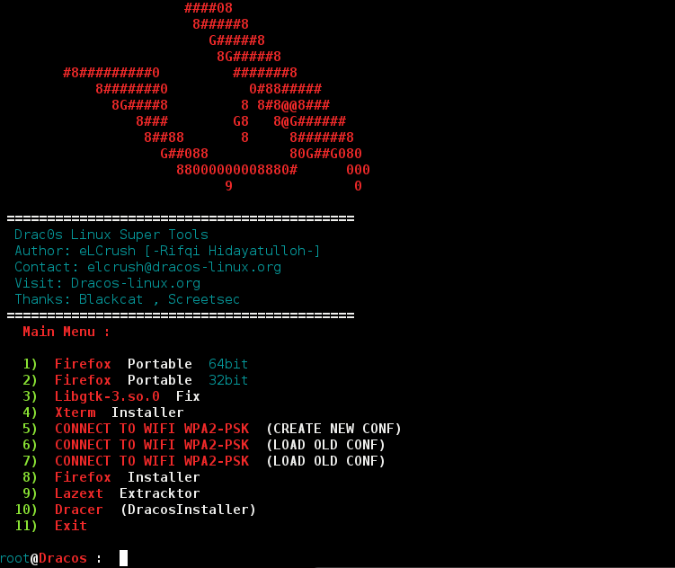

# Drac-Command
Drac-Command (DracOs Command Simple) is an open source program which is using to install or  connect wifi wpa or wpa-2psk quickly and easily.

# How To Run
* bash super-dracOS.sh

# Preview

